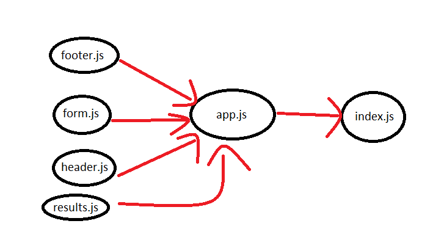

# resty

### Author: Esra'a Mamoun

### Links and Resources

- [submission PR - class-28](https://github.com/EsraaMamoun-401-advanced-javascript/deploy-resty/pull/5)

- [Netlify-URL](https://deploynetlify.netlify.app/)

- [Github-URL](https://esraamamoun-401-advanced-javascript.github.io/deploy-resty/)

### Setup

### Modules
- footer.js
- form.js
- header.js
- results.js
- app.js
- index.js

### Packages
- node-sass
- react
- react-dom
- react-scripts
- react-json-view
- react-jsonschema-form
- react-test-renderer
- enzyme 
- enzyme-adapter-react-16

#### How to initialize/run your application (where applicable)

- `npm run start`

#### Tests
- console.log

* How do you run tests?
 > - `npm test` 

#### UML
